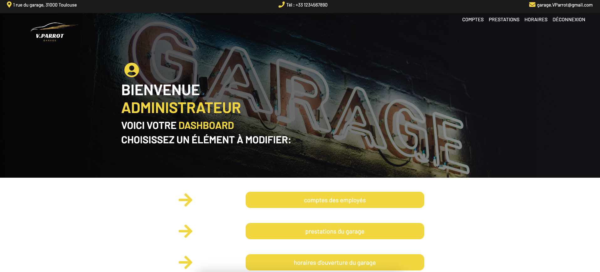
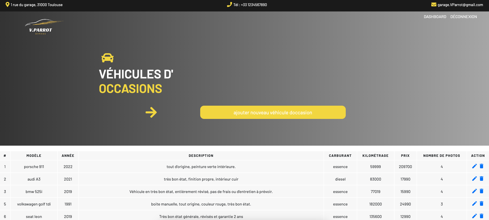
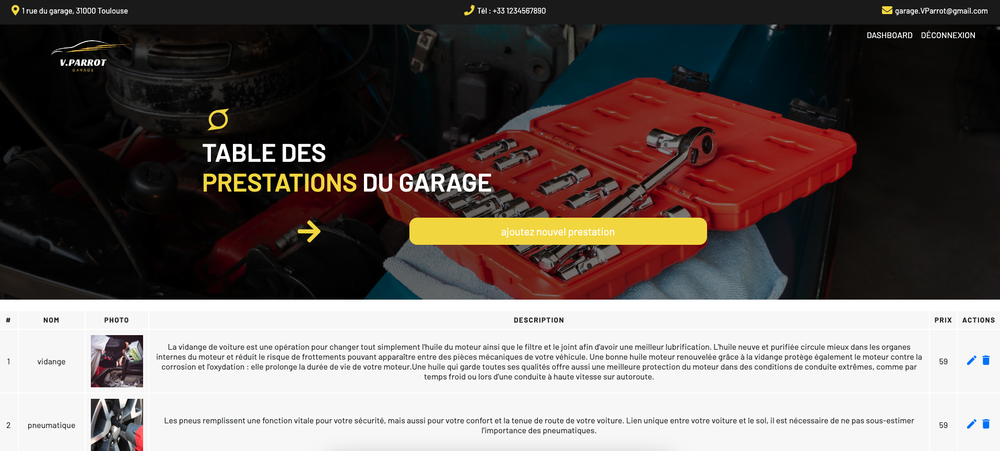

# GARAGE V PARROT
## Description

Service de gestion des prestations et services d'un garage automobile


## Website

- [Garage V.Parrot](https://garageautovparrot.000webhostapp.com)


## Auteur 

- [@vartcat](hhttps://github.com/vartcat)


## Installation en Local

Ce guide vous aidera à installer le projet localement en utilisant PHP avec PDO (PHP Data Objects) pour la connexion à une base de données MySQL, ainsi que Bootstrap pour le design et CSS/jQuery pour l'interactivité.

1. ### Prérequis :

Assurez-vous d'avoir les éléments suivants installés sur votre machine :
- Serveur Web (Apache, Nginx, etc.)
- PHP (version 8.0 ou supérieure)
- MySQL
- Un éditeur de texte ou un environnement de développement intégré (IDE) comme Visual Studio Code, Sublime Text, etc.

2. ### Téléchargement du Projet :

```sh
git clone https://github.com/vartcat/garageAuto   
cd garageAuto
composer install
```
3. ### Gestion de la base de données :

#### Configuration de la BD Local:

- Ouvrez votre gestionnaire de base de données (par exemple, phpMyAdmin).
- Créez une nouvelle base de données et notez son nom : "garage_automobile"
- Importez le fichier SQL fourni avec le projet dans la base de données nouvellement créée, ou utilisez la ligne de commande :

```sh
    mysql -u root -p garage_automobile < garage_automobile.sql
```
4. #### Configuration de PDO :

- Dans le répertoire du projet, ouvrez le fichier de configuration de la base de données (config/Config.php) dans un éditeur de texte.
- Modifiez les paramètres de connexion PDO pour correspondre à votre configuration de base de données (hôte, nom de la base de données, nom d'utilisateur, mot de passe).

```php
    define("DB_HOST", "localhost");
    define("DB_USER", "root");
    define("DB_PASS", "root");
    define("DB_NAME", "production_garage_automobile");
```

5. #### Configuration de S3 (Simple Storage Service) :

- Dans le fichier de configuration (config/Config.php), ajoutez les crédentials pour le service
[S3](https://aws.amazon.com/fr/s3/) d'Amazon, utilisé ici pour stocker les images de la base de données.

```php
    define("S3_BUCKET", "bucket");
    define("S3_REGION", "us-north-1");
    define("S3_APIKEY", "api-key");
    define("S3_SECRET", "secret");
    define("S3_BASEURL", "https://url.s3.us-north-1.amazonaws.com/");
```

6. #### Accès au Projet :

- Lancez votre serveur web local.
- Dans votre navigateur web, accédez au projet en utilisant l'URL correspondant à l'emplacement où vous avez placé les fichiers du projet.

7. #### Connexion au Dashboard Administrateur :

- Accédez à l'URL http://localhost:8888/login

Identifiants par défaut :
- **Identifiant :** rootadmin@mail.com
- **Mot de passe :** root




